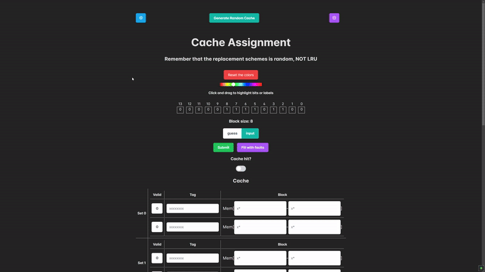
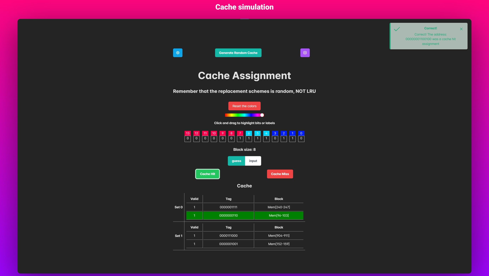

# **cache-hit-miss**
[](./LICENSE)  
[]  
[]  

An **interactive learning platform** for **CompSys** students to explore **cache memory concepts** through simulations and exercises.  

---

## **Project Goals**
✅ Simulate cache behavior for better conceptual understanding.  
✅ Let users **manipulate cache data** based on arbitrary addresses.  
✅ Teach cache structure, including **sets, block size, associativity, and total cache size**.  

---

## **Tech Stack**
[](https://reactjs.org/)  
[](https://www.typescriptlang.org/)  
[](https://vitejs.dev/)  

---

## **Getting Started**
Clone the repository and install dependencies:
```sh
git clone https://github.com/MahmoodSeoud/cache-hit-miss.git  
cd cache-hit-miss  
npm install  
npm run dev  
```

---

## **Demo**
### GIF Preview
  

### Screenshot
  

---

## **Development**
### Run in Development Mode
```sh
npm run dev  
```
### Build for Production
```sh
npm run build  
```
### Run Tests
```sh
npm run test  
```

---

## **Documentation**
- [Report](#)
